# Moodit – Sentiment Analysis of Reddit

Moodit is a high-performance, two-tier web dashboard that analyzes real-time public sentiment on Reddit for any keyword or topic. Transitioned from a legacy Streamlit prototype, Moodit employs an ensemble machine learning scorer (VADER + TextBlob + DistilBERT) combined with spaCy-powered Named Entity Recognition (NER) and Google Gemini AI explanations. All searches, post metadata, and NLP scores are persisted asynchronously in PostgreSQL, allowing users to track sentiment trends over time and export detailed datasets.

## 📖 How to Use
* **Configure Search Parameters**: Enter any keyword or topic to search. Customize the analysis by targeting a specific subreddit, adjusting the post count, or selecting a custom time window (e.g., Last 24h, Last 7d).
* **Customize Weights & Entity Filters**: Tune the slider weights for VADER, TextBlob, and DistilBERT to shift the model bias. Select which Named Entity tags (such as `PERSON`, `ORG`, `PRODUCT`, `MONEY`, `GPE`) you want spaCy to extract.
* **View Dashboard Analytics**: Analyze interactive donut and timeline charts showing sentiment distribution. Explore bigram tables, grouped entities, and a custom word cloud highlighting frequent terms.
* **Review LLM Explanations**: Inspect detailed AI-generated explanations summarizing why the most extreme positive or negative posts were classified as such.
* **Export Datasets**: Export the full scraped dataset including scores, entities, and explanations directly to a CSV file.

## ⚙️ Implementation Process
The system uses a non-blocking asynchronous pipeline executed in backend worker tasks:

```mermaid
graph LR
    A[User Submits Search Parameters] --> B[FastAPI /api/search Endpoint]
    B --> C[Create SearchRequest Database Entry]
    C --> D[Trigger Asynchronous Background Task]
    D --> E[PRAW Fetch Reddit Posts]
    E --> F[Deduplicate Posts via Database Check]
    F --> G[Clean Text: Remove URLs, Preserve $, %, +, -]
    G --> H[Ensemble Sentiment Engine]
    H --> I[VADER Score]
    H --> J[TextBlob Score]
    H --> K[DistilBERT Classification & Confidence Score]
    I & J & K --> L[Calculate Weighted Ensemble Score & Label]
    L --> M[Extract spaCy Entities based on Filters]
    M --> N[Query Gemini API for Extreme Sentiments]
    N --> O[Save Results to PostgreSQL & Update Status]
    O --> P[Next.js Dashboard Displays Interactive UI]
```



### Key Logic & Algorithms
* **Text Preprocessing**: Cleans input using regular expressions to strip out HTML/URLs while preserving critical symbols like `$`, `%`, `+`, and `-` which are highly contextual for sentiment analysis.
* **Ensemble Sentiment Scorer**: Computes a normalized score combining three methodologies:
  $$\text{Ensemble Score} = w_{v} \cdot \text{Vader} + w_{b} \cdot \text{TextBlob} + w_{t} \cdot (\text{BERT Confidence} \cdot \text{Sign})$$
  This leverages VADER (lexicon-based rules), TextBlob (linguistic polarity), and DistilBERT (Transformer-based context) for maximum robustness.
* **Named Entity Recognition**: Uses spaCy's `en_core_web_sm` pipeline to locate and filter entity labels based on user selection.
* **Gemini LLM Optimization**: To reduce API request latency and token usage, the pipeline only queries `gemini-2.0-flash` to explain the 3 most extreme positive and 3 most extreme negative posts.

## 🛠️ Tech Stack
| Tier | Technology | Description |
| :--- | :--- | :--- |
| **Frontend Framework** | Next.js (TypeScript) | High performance React framework for dashboard views |
| **Styling & UI** | Tailwind CSS & shadcn/ui | Beautiful glassmorphism design system & prebuilt components |
| **Backend API** | FastAPI (Python) | High performance web framework with async operations |
| **Database** | PostgreSQL | Relational storage for search queries, posts, and entities |
| **Database ORM** | SQLAlchemy (Asyncpg) | Asynchronous ORM database client |
| **Data Fetching** | PRAW (Reddit API Wrapper) | Library for accessing Reddit's official developer API |
| **NLP Libraries** | VADER, TextBlob, spaCy | Lexical sentiment, polarity, and Named Entity Recognition |
| **Deep Learning** | Hugging Face Transformers | DistilBERT transformer model pipeline for classification |
| **Generative AI** | Google GenAI SDK | Integration with `gemini-2.0-flash` for sentiment explanations |

## 💻 Setup & Installation

### Prerequisites
* Python 3.10+
* Node.js v18+
* PostgreSQL server

### Backend Setup
1. Navigate to the backend directory:
   ```bash
   cd backend
   ```
2. Create and activate a Python virtual environment:
   ```bash
   python -m venv venv
   # On Windows:
   .\venv\Scripts\activate
   # On macOS/Linux:
   source venv/bin/activate
   ```
3. Install the dependencies:
   ```bash
   pip install -r requirements.txt
   ```
4. Create a `.env` file in the `backend/` directory based on the `.env.example` file:
   ```env
   DATABASE_URL=postgresql+asyncpg://<username>:<password>@localhost:5432/moodit
   REDDIT_CLIENT_ID=your_reddit_client_id
   REDDIT_CLIENT_SECRET=your_reddit_client_secret
   REDDIT_USER_AGENT=your_reddit_user_agent
   GEMINI_API_KEY=your_gemini_api_key
   ```
5. Ensure your PostgreSQL database `moodit` exists.
6. Run the FastAPI development server:
   ```bash
   python -m uvicorn app.main:app --port 8000 --reload
   ```

### Frontend Setup
1. Navigate to the frontend directory:
   ```bash
   cd frontend
   ```
2. Install the node packages:
   ```bash
   npm install
   ```
3. Create a `.env.local` file in the `frontend/` directory:
   ```env
   NEXT_PUBLIC_API_URL=http://localhost:8000
   ```
4. Start the development server:
   ```bash
   npm run dev
   ```
5. Open [http://localhost:3000](http://localhost:3000) in your web browser.

## 🔌 API Endpoints
* `GET /health`: Health check route verifying backend and database connectivity.
* `POST /api/search`: Initiates a new keyword search. Spawns an asynchronous background worker task and returns the search metadata.
* `GET /api/search/{search_id}`: Retrieves the status metadata (`pending`, `running`, `completed`, `failed`) of a search.
* `GET /api/search/{search_id}/results`: Retrieves all parsed posts, sentiments, entity counts, bigrams, and LLM explanations for a completed search request.

## 📂 Project Structure
```
moodit-mood-of-reddit/
├── backend/
│   ├── app/
│   │   ├── analysis.py       # PRAW fetch, cleaning, spaCy NER, ensemble scoring, Gemini
│   │   ├── config.py         # App configuration & settings
│   │   ├── database.py       # Database engine & async sessionmaker
│   │   ├── main.py           # FastAPI routes & CORS configuration
│   │   ├── models.py         # SQLAlchemy database schemas
│   │   ├── pipeline.py       # Asynchronous background runner orchestrator
│   │   └── schemas.py        # Pydantic validation schemas
│   ├── .env.example
│   └── requirements.txt
├── frontend/
│   ├── app/
│   │   ├── globals.css       # Tailwind CSS & global layout overrides
│   │   ├── layout.tsx        # NextJS layout context
│   │   ├── page.tsx          # Dashboard landing / submission form
│   │   └── results/[id]/     # Results page rendering charts, wordclouds, & tables
│   ├── components/
│   │   ├── charts/
│   │   │   ├── DonutChart.tsx
│   │   │   └── TimelineChart.tsx
│   │   ├── BigramsTable.tsx
│   │   ├── EntitiesTable.tsx
│   │   ├── PostCard.tsx
│   │   ├── SearchForm.tsx
│   │   ├── StatusProgress.tsx
│   │   └── WordCloud.tsx
│   ├── .env.example
│   └── package.json
└── README.md
```

## 📤 Exports
* **CSV Export**: The application provides an export functionality located on the search results dashboard page. This compiles and downloads all processed posts, their respective metadata, VADER/TextBlob/DistilBERT breakdown scores, ensemble scores, overall sentiment labels, spaCy extracted entities, and Google Gemini AI text explanations into a single downloadable `.csv` file.

## 📄 License
This project is licensed under the MIT License.
